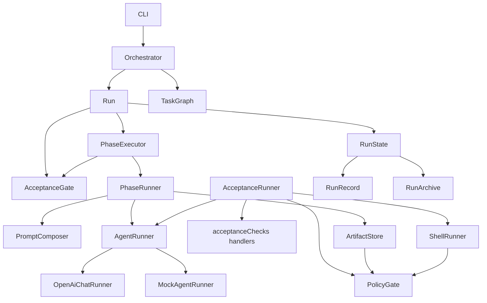
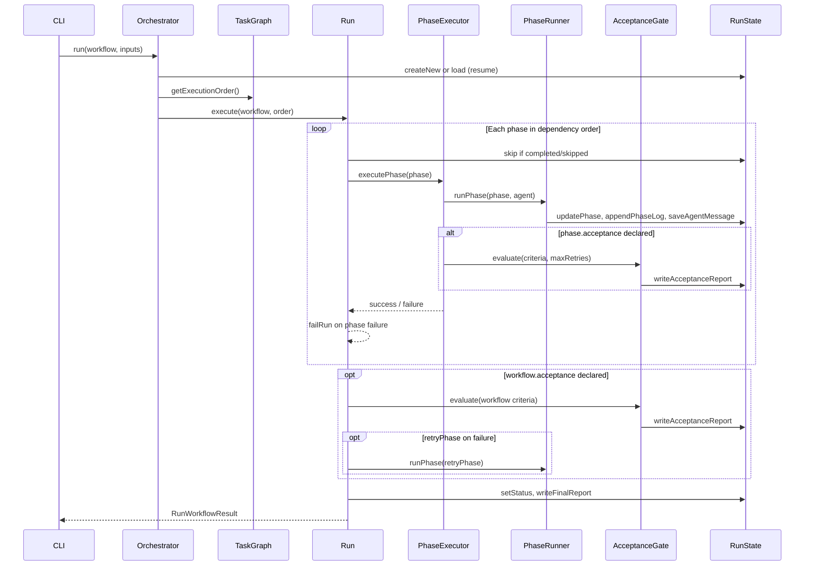
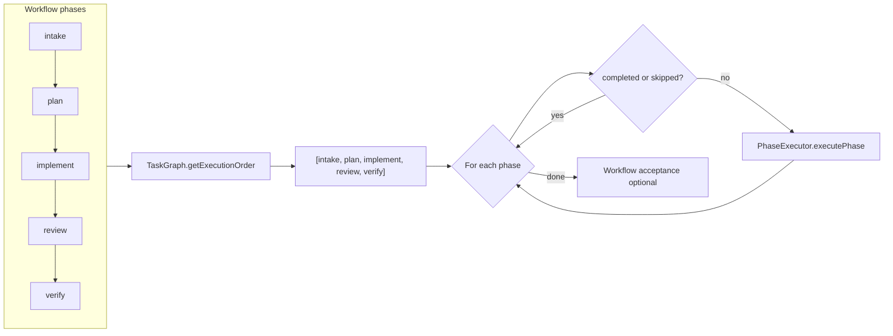
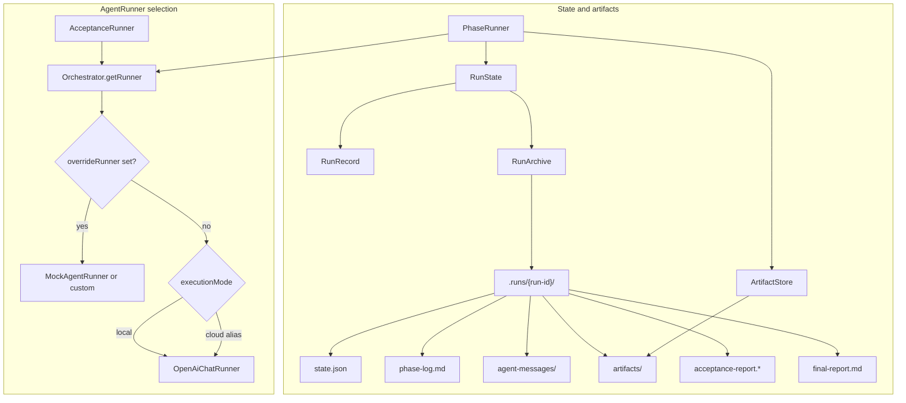

# Architecture

## Overview

oaiorchestrator separates **workflow definition**, **execution**, **acceptance**, and **persistence** into small modules. The OpenAI-compatible HTTP client lives only inside runner implementations — the core never calls a model endpoint directly.

> **Keeping diagrams current:** When you change orchestrator flow, `dependsOn` ordering, persistence layout, or runner wiring, update the Mermaid diagrams in this document in the same PR. The [component map](#component-map) is the canonical high-level view; the [run lifecycle](#run-lifecycle), [phase dependency execution](#phase-dependency-execution), and [persistence and runner selection](#persistence-and-runner-selection) sections drill into specific paths.

### Component map



### Run lifecycle

From `Orchestrator.run()` through per-phase work and workflow-level acceptance. `PhaseExecutor` is the seam between agent execution and phase-level checks; `Run` owns the outer loop and final workflow acceptance.



### Phase dependency execution

`TaskGraph` builds execution order from each phase's `dependsOn` using depth-first topological sort. Cycles are rejected at workflow validation and again at runtime. On resume, `Run` skips phases already marked `completed` or `skipped`.



### Persistence and runner selection

`RunState` is the facade callers use; `RunRecord` holds in-memory phase status and sessions; `RunArchive` writes the `.runs/<run-id>/` tree. `Orchestrator.getRunner(mode)` selects the agent adapter — the core never calls the chat-completions API directly.



## Core components

### Orchestrator

Wires agent runners, shell runner, and policies; builds run context; delegates workflow execution to `Run`.

### Run

Owns the workflow walk: phase loop (via `PhaseExecutor`), workflow-level acceptance with retry remediation, final report, and failure paths.

### PhaseExecutor

Single seam for a phase: agent execution (`PhaseRunner`) followed by phase-level acceptance (`AcceptanceGate`) when criteria are declared.

### PromptComposer

Central prompt assembly for phase work — objective, task, artifacts, skills, and agent role instructions.

### TaskGraph

Builds execution order from `dependsOn` using depth-first topological sort. Detects cycles at validation and runtime.

### AgentRegistry

Maps workflow agent IDs to merged configs (workflow overrides + built-in type defaults). New agent types are registered by adding a module under `src/agents/`.

### PhaseRunner

Builds phase prompts, selects the correct runner by execution mode, persists agent messages and artifacts, and handles per-phase retries.

### AcceptanceRunner

Dispatches acceptance checks to handler modules under `src/orchestrator/acceptanceChecks/` and returns an `AcceptanceReport`.

### AcceptanceGate

Evaluates a criteria set with retry policy and optional remediation. Both phase-level and workflow-level acceptance use this module so retry semantics stay consistent.

### RunReports

Formats acceptance and final reports. `RunState` persists the rendered output.

### RunState

Facade over `RunRecord` (in-memory phase status and sessions) and `RunArchive` (`.runs/<run-id>/` layout, `state.json`, logs, and reports).

## Runner abstraction

```typescript
export interface AgentRunner {
  run(input: AgentRunInput): Promise<AgentRunResult>;
}
```

The orchestrator calls `getRunner(mode)` — never posts to the chat-completions API directly. The default adapter is `OpenAiChatRunner` (`src/runners/openAiChatRunner.ts`), which sends the composed phase prompt to any OpenAI-compatible `/v1/chat/completions` endpoint (`OPENAI_BASE_URL`, default `https://api.openai.com/v1`, with `OPENAI_API_KEY` auth). Both `local` and `cloud` execution modes currently resolve to this runner — `cloud` is an alias kept for workflow compatibility until a hosted variant exists. Phase prompts are composed by `PromptComposer` before the runner is invoked. Inject `MockAgentRunner` in tests or custom runners for CI.

The model only returns text — it cannot execute commands or write files. The runner extracts expected output artifacts from fenced code blocks tagged with a filename (for example ```` ```json name=plan.json ```` ) and writes them into `.runs/<run-id>/artifacts/`. If the model does not emit a named block, `PhaseRunner` backfills the expected output with the full response text. All verification then runs host-side as acceptance criteria.

Because a chat-completions model cannot read files from the host, a phase's declared `inputs` are embedded directly into its prompt: `buildPhaseInputArtifacts` reads each input artifact from `.runs/<run-id>/artifacts/` and inlines its content (capped per artifact) so dependent phases see prior outputs.

Before phases start, `Orchestrator.run()` resolves a GitHub `repoUrl` when `executionMode` is `cloud` (`src/util/resolveRepoUrl.ts`) and records it in run context. CLI and library callers share this path; cloud runs fail fast when no URL can be resolved.

For endpoint trust, host-side verification, and policy scope, see [security.md](security.md).

## Extension points

| Extend | Location |
|--------|----------|
| Agent type | `src/agents/*.agent.ts` |
| Acceptance check | `src/schemas/acceptance.schema.ts`, `src/orchestrator/acceptanceChecks/` |
| Agent runner | `src/runners/` |
| Policy rule | `src/policies/` (`PolicyGate` for enforcement at call sites) |
| Workflow | YAML under `src/examples/` or `workflows/` |

## Resumption and error recovery

`state.json` tracks per-phase status. `orchestrator resume` skips completed/skipped phases and continues from pending work. Interrupted phases (`running` / `retrying`) are reset to `pending` before the walk restarts.

Failures are classified by scope (`phase` vs `workflow`) and kind (agent execution, exception, acceptance). See [error-recovery.md](error-recovery.md) for the full model, partial-progress logging, and resume semantics.

## Safety

- `commandPolicy` blocks destructive git/filesystem commands by default
- `filePolicy` prevents access outside workspace root
- `approvalPolicy` gates deletions, pushes, secrets, and manual checks
- `redactSecrets` scrubs common token patterns from logs

These policies guard host-side acceptance checks and orchestrator artifact I/O. The LLM itself only returns text — it cannot execute commands or write files; the host proves every claim through acceptance criteria. See [security.md](security.md) for the full threat model and operator checklist.
