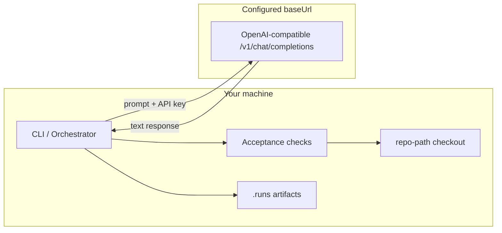

# Security

Security considerations for oaiorchestrator, with emphasis on **endpoint trust**: phase prompts and artifacts are sent to whatever OpenAI-compatible endpoint you configure, while all verification runs on your machine.

## Scope

This document covers:

- What data and capabilities are exposed when you run workflows
- The host-verification principle that bounds what the model can do
- Mitigations built into the orchestrator today
- Known gaps and planned improvements

Operational setup (CLI flags, environment variables) lives in [getting-started.md](getting-started.md). Runner wiring is in [architecture.md](architecture.md#runner-abstraction).

## Key principle: the LLM proposes; the host proves

The model only returns text. It cannot execute commands, write files, or touch your repository. The runner extracts expected artifacts from named fenced code blocks in the response and writes them under `.runs/<run-id>/artifacts/` — that is the model's entire reach. All verification (shell commands via `pwsh`, Pester/Vitest parsers, file checks, manual approval) runs **host-side** as acceptance criteria. A run only succeeds when the host proves the model's claims.

The `research-installer.workflow.yaml` example demonstrates this: the model proposes a download URL and SHA256; host-side checks download the file, recompute the hash with `Get-FileHash`, and validate the Authenticode signature.

## Threat model: the model endpoint

`OpenAiChatRunner` posts composed phase prompts to the configured `/v1/chat/completions` endpoint (`OPENAI_BASE_URL`, per-agent `baseUrl`, or the default `https://api.openai.com/v1`).

### Assets at risk

| Asset | Exposure |
|-------|----------|
| Phase prompts | Sent to the configured endpoint (objective, task text, prior artifacts, skills) |
| `OPENAI_API_KEY` | Used by the orchestrator process on your machine to authenticate requests |
| Run artifacts | Written locally under `.runs/<run-id>/` (messages, reports, logs) |
| Local checkout (`--repo-path`) | Used for acceptance checks and artifact storage; never sent to the endpoint wholesale |

### Threat scenarios

**Endpoint trust.** You send prompts and prior artifacts to whatever `baseUrl` is configured — standard OpenAI, Azure OpenAI, xAI/Grok, or a custom gateway. Only point the orchestrator at endpoints you trust. A malicious or compromised endpoint sees everything embedded in prompts and can return adversarial text, which is why all verification stays host-side.

**Prompt and context exfiltration.** Phase prompts may include task descriptions, file excerpts from prior artifacts, skill text, and acceptance context. Anything embedded in a prompt is transmitted to the endpoint. Do not put secrets, credentials, or regulated data in workflow task strings or artifact content intended for agent consumption.

**Adversarial model output.** Model responses are written as artifacts and can flow into later phase prompts. They never execute directly — `command` acceptance checks come from the **workflow YAML you wrote**, not from model output — but treat artifacts as untrusted input when humans or downstream tools consume them.

**API key handling.** The orchestrator reads `OPENAI_API_KEY` (fallback `AI_REVIEW_TOKEN`) from the environment or runner options. Keys in shell history, CI logs, or shared `.env` files are out of scope for orchestrator redaction until they appear in captured output.

**Run artifact leakage.** `.runs/` stores agent transcripts and reports on disk. These may summarize code, errors, or command output. Restrict filesystem permissions and add `.runs/` to backup/retention policies as needed.

### Trust boundaries

## Execution modes

| Mode | Behavior |
|------|----------|
| `local` (default) | `OpenAiChatRunner` against the configured endpoint; everything else runs on your machine |
| `cloud` | Alias of the same `OpenAiChatRunner`, kept for workflow compatibility until a hosted variant exists; still requires a resolvable GitHub `repoUrl` (recorded in run context) |

**Dry-run and mock runs.** Use `--dry-run` or inject `MockAgentRunner` when validating workflows without calling any endpoint — no data leaves your machine, no API key required for agent phases.

## Current mitigations

Policies guard host-side acceptance execution and artifact persistence; redaction guards what gets written to disk.

### Policy gate (acceptance and artifacts)

| Policy | Module | What it does |
|--------|--------|--------------|
| Command policy | `src/policies/commandPolicy.ts` | Blocks destructive commands (force push, hard reset, `rm -rf`, etc.) in shell and `command` acceptance checks when `enforcePolicy` is enabled |
| File policy | `src/policies/filePolicy.ts` | Blocks paths outside workspace root; blocks `.git/` and `node_modules/` writes; flags sensitive paths (`.env`, keys, credentials) |
| Approval policy | `src/policies/approvalPolicy.ts` | Records approval requests for risky commands, file deletes, and `manual_approval` checks; supports auto-approve flags for tests/CI |

`PolicyGate` (`src/policies/PolicyGate.ts`) enforces command blocks for `NodeShellRunner` and `command` checks. `ArtifactStore` enforces file policy on orchestrator-managed artifact writes.

### Secret redaction (outputs)

`redactSecrets` scrubs common token patterns from:

- Shell stdout/stderr (`NodeShellRunner`)
- Model output and error messages (`openAiChatRunner.ts`)

Redaction runs **after** model or shell execution, before persisting to `.runs/`. It does **not** remove secrets from prompts sent to the endpoint.

### Run isolation and audit

Each run writes an isolated directory under `.runs/<run-id>/` with workflow snapshot, state, transcripts, and acceptance reports — supporting review after the fact.

## Known gaps and future work

| Gap | Risk | Direction |
|-----|------|-----------|
| No interactive CLI approval flow | `ApprovalPolicy` requests stay `pending` unless auto-approved | Add pause/resume or explicit approve/deny commands for production runs |
| Prompts not redacted before send | Secrets in task text reach the configured endpoint | Pre-send secret scan on composed prompts; workflow validation warnings |
| Limited secret patterns | Novel token formats may leak into logs | Expand `SECRET_PATTERNS`; allow user-defined patterns |
| No endpoint allowlist | A typo or hostile `baseUrl`/`OPENAI_BASE_URL` silently receives prompts | Optional allowlist of trusted base URLs; warn on per-agent `baseUrl` overrides |
| Third-party skills in prompts | Bundled and workspace `skills/` content is injected into prompts | Review skill content before runs on sensitive repos |

Contributions that close these gaps should extend schemas and policies first, then wire enforcement at documented call sites — see [AGENTS.md](../AGENTS.md).

## Operator checklist

Before a live run on a sensitive repository:

1. Confirm `$env:OPENAI_BASE_URL` (and any per-agent `baseUrl`) points only at endpoints you trust — prompts and prior artifacts go there.
2. Remove secrets from task strings and artifact templates agents will read.
3. Keep `OPENAI_API_KEY` in environment variables, not workflow YAML or committed config.
4. Confirm `--repo-path` is the intended workspace for acceptance checks and artifacts.
5. Leave `enforcePolicy: true` on `NodeShellRunner` unless you have a controlled test harness.
6. Review `.runs/<run-id>/` artifacts after the run; treat them like security-sensitive logs.

For validation without any endpoint traffic, use `--dry-run` or `MockAgentRunner`.

## Related documentation

- [Getting started — Configure the model endpoint](getting-started.md#configure-the-model-endpoint-live-runs-only)
- [Agents — Execution modes](agents.md#execution-modes)
- [Architecture — Runner abstraction and Safety](architecture.md#runner-abstraction)
- [Acceptance criteria — Policy interaction](acceptance-criteria.md#policy-interaction)
